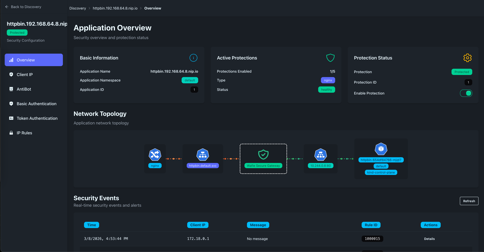
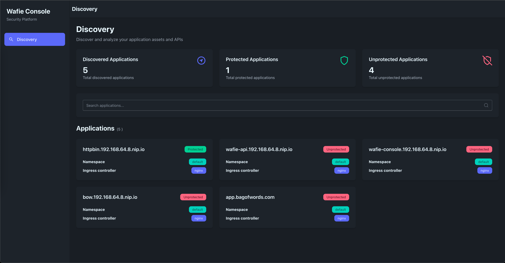
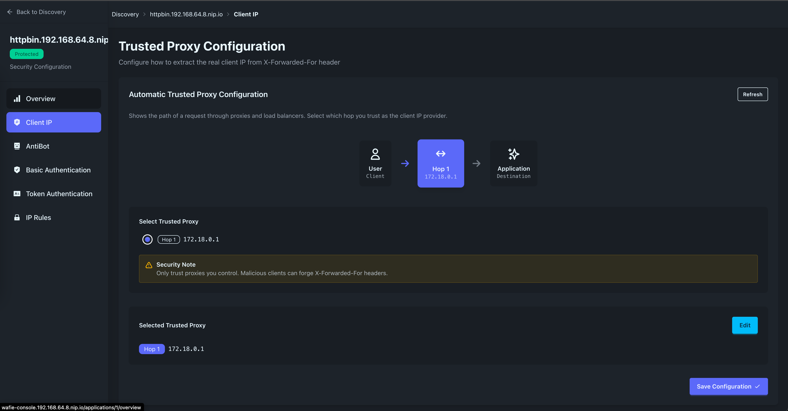
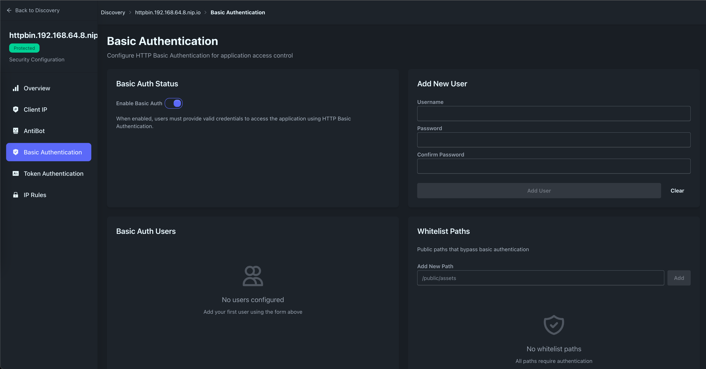
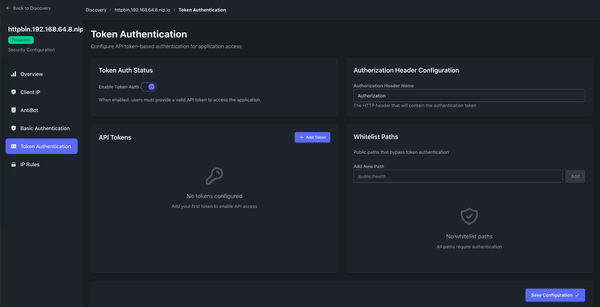
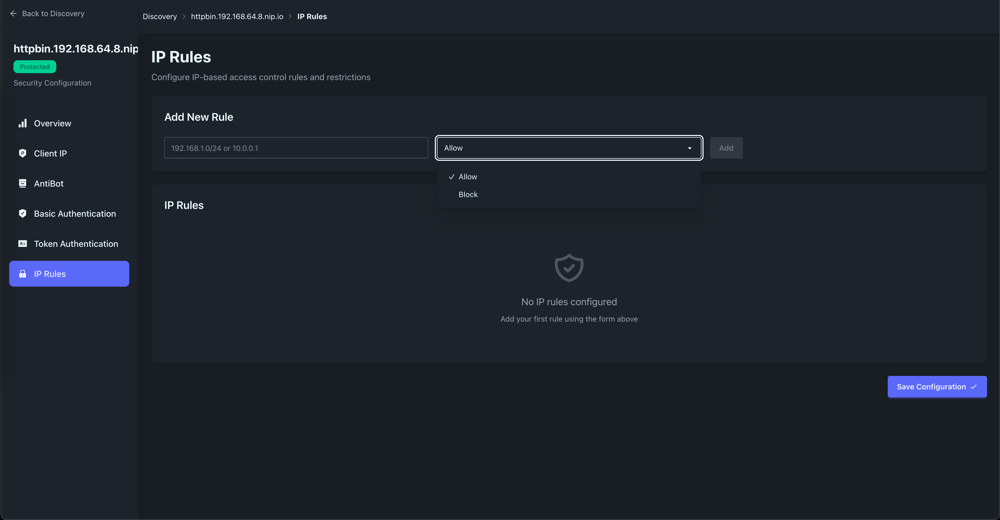
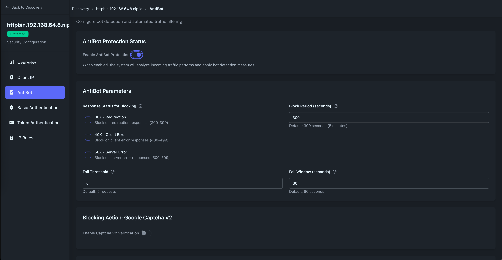

# Wafie - AI ready, Kubernetes native WAF and API protection platform



## Why? 
The core mission of Wafie is to accomplish a very different and broad set of application networking (L7) tasks
in a simple, fast, and scalable manner. A wide variety of functions, including basic security controls, 
access management, rate limiting, and request/response transformation, can be performed.

## For who?
If you are a Developer/DevOps/SRE/Platform engineer who runs workloads on Kubernetes cluster
and looking for unified middleware to manage applications L7 networking 
and security without changing the existing code-base, Wafie can help you with that.

## How?
* **Kubernetes-Native**: Designed from the ground up to leverage Kubernetes primitives for configuration, 
integration, and deployment, making it seamless for cloud-native teams
* **AI-Ready**: Simply describe the desired functionality in plain English 
once the Wafie agent is connected to the model, and the Wafie engine will handle the rest.
* **Unified Platform**: Serving as a single control point for security (WAF), 
traffic management (proxies), and modern API gateway functionality (API protection), 
eliminating the need to "jungle" multiple disparate tools.

## Wafie components
* **libmodsecurity** - The core component, [libmodsecurity](https://github.com/owasp-modsecurity/ModSecurity), 
is a firewall engine that processes CRS rules. 
These rules are defined in SecLang, a language easily understood by any AI agent. 
This synergy means that humans can express security or networking requirements in plain English, 
and an AI agent can seamlessly translate them into SecLang for the libmodsecurity engine to execute.
* **envoy** - the cloud native proxy server
* **wafie:ext_proc** - [envoy external processing](https://www.envoyproxy.io/docs/envoy/latest/configuration/http/http_filters/ext_proc_filter)
server acting as a glue between libmodsecurity and envoy proxy
* **wafie:discovery** - discovery agent that watch for your K8s Ingress and Service and automatically generating Envoy control plane configurations
* **wafie:relay** - proxying applications traffic without a need for sidecars containers.
* **wafie:api** - api server


---

# Installation

## Prerequisites
- Kubernetes cluster (1.19+)
- Helm 3.8+
- kubectl configured to access your cluster

## Installing the Helm Chart

### Install Latest Version

```bash
helm install wafie oci://ghcr.io/wafieio/charts/wafie \
  --set api.ingress.host="wafie-api.example.com" \
  --set console.ingress.host="wafie-console.example.com"
```

### Install Specific Version

```bash
helm install wafie oci://ghcr.io/wafieio/charts/wafie --version 0.0.2 \
  --set api.ingress.host="wafie-api.example.com" \
  --set console.ingress.host="wafie-console.example.com"
```

### Install with Custom Values File

```bash
helm install wafie oci://ghcr.io/wafieio/charts/wafie -f custom-values.yaml
```

## List Available Versions

### View on GitHub Packages
https://github.com/wafieio/wafie/pkgs/container/charts%2Fwafie

### View on GitHub Releases
https://github.com/wafieio/wafie/releases

## Upgrading the Chart

### Upgrade to Latest Version

```bash
helm upgrade wafie oci://ghcr.io/wafieio/charts/wafie
```

### Upgrade to Specific Version

```bash
helm upgrade wafie oci://ghcr.io/wafieio/charts/wafie --version 0.0.2
```

### Upgrade with New Values

```bash
helm upgrade wafie oci://ghcr.io/wafieio/charts/wafie \
  --set api.ingress.host="new-api.example.com" \
  --reuse-values
```

## Uninstalling the Chart

```bash
helm uninstall wafie
```

To also delete the namespace (if dedicated):
```bash
helm uninstall wafie
kubectl delete namespace wafie
```

## Chart Information

### Show Chart Details

```bash
# Show all chart information
helm show all oci://ghcr.io/wafieio/charts/wafie --version 0.0.2

# Show only values
helm show values oci://ghcr.io/wafieio/charts/wafie --version 0.0.2

# Show only readme
helm show readme oci://ghcr.io/wafieio/charts/wafie --version 0.0.2
```

### Check Deployed Status

```bash
# List all releases
helm list

# Get release status
helm status wafie

# Get release values
helm get values wafie
```

## Production Deployment Example

```bash
helm install wafie oci://ghcr.io/wafieio/charts/wafie --version 0.0.2 \
  --create-namespace \
  --namespace wafie \
  --set api.ingress.host="wafie-api.stg.wafie.io" \
  --set api.ingress.annotations."cert-manager\.io/cluster-issuer"=letsencrypt-prod \
  --set console.ingress.host="wafie-console.stg.wafie.io" \
  --set console.ingress.annotations."cert-manager\.io/cluster-issuer"=letsencrypt-prod
```
 

### Local Dev Deployment Setup
```bash
cat <<EOF | kind create cluster --config=-
kind: Cluster
apiVersion: kind.x-k8s.io/v1alpha4
name: kind
nodes:
- role: control-plane
  extraPortMappings:
  - containerPort: 30980
    hostPort: 80
    protocol: TCP
  - containerPort: 30943
    hostPort: 443
    protocol: TCP
EOF
```

### Deploy Nginx Ingress Controller from [nginx-ingress.yaml](ops/kind/nginx-ingress.yaml)
```bash
kubectl create -f ops/kind/nginx-ingress.yaml
```

Check all wafie pods are running
```bash
kubectl get pods -l 'app in (wafie-relay,appsecgw,wafie-control-plane)'
```

---

## Configuration Parameters

The following table lists the configurable parameters of the Wafie chart and their default values.

### API (Control Plane)

| Parameter                 | Description                   | Default              |
|---------------------------|-------------------------------|----------------------|
| `api.image`               | API server container image    | `wafieio/api:latest` |
| `api.ingress.enabled`     | Enable ingress for API server | `true`               |
| `api.ingress.tls`         | Enable TLS for API ingress    | `true`               |
| `api.ingress.host`        | Hostname for API server       | `""`                 |
| `api.ingress.annotations` | Ingress annotations           | `{}`                 |
| `api.ingress.secretName`  | TLS secret name               | `wafie-api-certs`    |
| `api.ingress.class`       | Ingress class name            | `nginx`              |
| `api.svc.name`            | API service name              | `wafie-api`          |
| `api.svc.port`            | API service port              | `80`                 |

### Discovery Agent

| Parameter              | Description                     | Default              |
|------------------------|---------------------------------|----------------------|
| `discoveryAgent.image` | Discovery agent container image | `wafieio/api:latest` |

### Gateway

| Parameter       | Description                        | Default                    |
|-----------------|------------------------------------|----------------------------|
| `gateway.ads`   | Gateway ADS container image        | `wafieio/gateway:latest`   |
| `gateway.proxy` | Envoy proxy container image        | `envoyproxy/envoy:v1.36.2` |
| `gateway.xproc` | External processor container image | `wafieio/xproc:latest`     |

### Relay

| Parameter     | Description           | Default                |
|---------------|-----------------------|------------------------|
| `relay.image` | Relay container image | `wafieio/relay:latest` |

### Console

| Parameter                     | Description                    | Default                        |
|-------------------------------|--------------------------------|--------------------------------|
| `console.enabled`             | Enable console deployment      | `true`                         |
| `console.image`               | Console container image        | `wafieio/wafie-console:latest` |
| `console.ingress.enabled`     | Enable ingress for console     | `true`                         |
| `console.ingress.tls`         | Enable TLS for console ingress | `true`                         |
| `console.ingress.host`        | Hostname for console           | `""`                           |
| `console.ingress.annotations` | Ingress annotations            | `{}`                           |
| `console.ingress.secretName`  | TLS secret name                | `wafie-console-certs`          |
| `console.ingress.class`       | Ingress class name             | `nginx`                        |

### PostgreSQL

| Parameter                                        | Description                              | Default                           |
|--------------------------------------------------|------------------------------------------|-----------------------------------|
| `postgresql.enabled`                             | Enable PostgreSQL deployment             | `true` (via dependency condition) |
| `postgresql.global.security.allowInsecureImages` | Allow insecure images                    | `true`                            |
| `postgresql.image.repository`                    | PostgreSQL image repository              | `bitnamilegacy/postgresql`        |
| `postgresql.auth.postgresPassword`               | PostgreSQL admin password                | `cwafpg`                          |
| `postgresql.auth.username`                       | Database username                        | `cwafpg`                          |
| `postgresql.auth.password`                       | Database password                        | `cwafpg`                          |
| `postgresql.auth.database`                       | Database name                            | `cwaf`                            |
| `postgresql.primary.persistence.size`            | Persistent volume size                   | `20Gi`                            |
| `postgresql.volumePermissions.enabled`           | Enable volume permissions init container | `false`                           |

### Example: Override Values with --set

```bash
helm install wafie oci://ghcr.io/wafieio/charts/wafie \
  --set api.image=wafieio/api:0.0.2 \
  --set gateway.proxy=envoyproxy/envoy:v1.37.0 \
  --set postgresql.auth.postgresPassword=mySecurePassword \
  --set postgresql.primary.persistence.size=50Gi
```

### Example: Override Values with values.yaml

Create a custom values file:

```yaml
# custom-values.yaml
api:
  image: wafieio/api:0.0.2
  ingress:
    host: "wafie-api.example.com"
    tls: true
    annotations:
      cert-manager.io/cluster-issuer: letsencrypt-prod
      nginx.ingress.kubernetes.io/ssl-redirect: "true"

console:
  enabled: true
  image: wafieio/wafie-console:0.0.2
  ingress:
    host: "wafie-console.example.com"
    tls: true
    annotations:
      cert-manager.io/cluster-issuer: letsencrypt-prod

gateway:
  ads: wafieio/gateway:0.0.2
  proxy: envoyproxy/envoy:v1.37.0
  xproc: wafieio/xproc:0.0.2

relay:
  image: wafieio/relay:0.0.2

postgresql:
  auth:
    postgresPassword: "mySecurePassword"
    username: "wafie_user"
    password: "userPassword"
    database: "wafie_db"
  primary:
    persistence:
      size: 50Gi
```

Install with the custom values file:

```bash
helm install wafie oci://ghcr.io/wafieio/charts/wafie --version 0.0.2 \
  -f custom-values.yaml
```


## UI Screenshots

### Automatic Service Discovery
Wafie automatically discovers your Kubernetes services and ingresses, making deployment seamless.



### Proxy Configuration
Configure advanced proxy settings and routing rules with an intuitive interface.



### Basic Authentication
Easily set up basic authentication for your applications without code changes.



### Token-Based Authentication
Implement token-based authentication and API key management.



### IP-Based Access Control
Define IP allowlists and blocklists to control access to your applications.



### Anti-Bot Protection
Protect your applications from bots with built-in CAPTCHA and challenge mechanisms.



